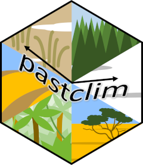

# pastclim 

<!-- badges: start -->

[](https://github.com/EvolEcolGroup/pastclim/actions/workflows/R-CMD-check.yaml)
[](https://github.com/EvolEcolGroup/pastclim/actions/workflows/R-CMD-check.yaml)
[](https://app.codecov.io/gh/EvolEcolGroup/pastclim)

<!-- badges: end -->

This `R` library is designed to provide an easy way to extract and
manipulate palaeoclimate reconstructions for ecological and
anthropological analyses.

The functionalities of `pastclim` are described in [Leonardi et al.
(2023)](https://doi.org/10.1111/ecog.06481). Please cite it if you use
`pastclim` in your research.

## Install the library

`pastclim` is on CRAN, and the easiest way to install it is with:

```         
install.packages("pastclim")
```

The version on CRAN is recommended for every day use. New features and
bug fixes appear first on the `dev` branch on GitHub, before they make
their way to CRAN. If you need to have early access to these new
features, you can install `pastclim` directly from GitHub. To install
from GitHub, you will need to use `devtools`; if you haven't done so
already, get it from CRAN with `install.packages("devtools")`. Also,
note that the `dev` version of `pastclim` tracks changes in the `dev`
version of `terra`, so you will need to upgrade both libraries with:

```         
install.packages('terra', repos='https://rspatial.r-universe.dev')

devtools::install_github("EvolEcolGroup/pastclim", ref="dev")
```

## Overview of functionality

On its dedicated [website](https://evolecolgroup.github.io/pastclim/),
you can find Articles giving you a step-by-step [overview of the
package](https://evolecolgroup.github.io/pastclim/articles/a0_pastclim_overview.html),
and a
[cheatsheet](https://evolecolgroup.github.io/pastclim/pastclim_cheatsheet.pdf).
There is also a [dev
version](https://evolecolgroup.github.io/pastclim/dev/) of the site
updated for the `dev` branch of `pastclim` (on the top left of the dev
website, the version number is in red and in the format x.x.x.9xxx,
indicating it is a development version).

Pastclim currently includes data from Beyer et al 2020, a reconstruction
of climate based on the HadCM3 model for the last 120k years, and Krapp
et al 2021, which covers the last 800k years. The reconstructions are
bias-corrected and downscaled to 0.5 degree. More details on these
datasets can be found
[here](https://evolecolgroup.github.io/pastclim/articles/a1_available_datasets.html).
There are also instructions on how to build and use [custom
datasets](https://evolecolgroup.github.io/pastclim/articles/a2_custom_datasets.html).

You can also build the vignettes when installing `pastclim` (note that
you will need to have the necessary tools to build vignettes already
installed; requirements depend on your OS):

```         
devtools::install_github("EvolEcolGroup/pastclim", build_vignette = TRUE)
```

If you built the vignettes, you can read them directly in R. For
example, the overview can be obtained with:

```         
vignette("pastclim_overview", package = "pastclim")
```

------------------------------------------------------------------------

## Current issues

If something does not work, check the [issues on
GitHub](https://github.com/EvolEcolGroup/pastclim/issues) to see whether
the problem has already been reported. If not, feel free to create an
new issue. Please make sure you have updated to the latest version of
`pastclim` on CRAN, as well as updating all other packages on your
system, and provide [a reproducible
example](https://stackoverflow.com/questions/5963269/how-to-make-a-great-r-reproducible-example)
for the developers to investigate the problem.

------------------------------------------------------------------------

### Error in x\$.self\$finalize()

`pastclim` relies on `terra` to process rasters. There is a known bug in
`terra` that leads to the occasional message:

```         
"Error in x$.self$finalize() : attempt to apply non-function"
```

This is an error related to garbage collection, which does not affect
the script being correctly executed, so it can be ignored. More
discussion of this issue can be found on
[stack**overflow**](https://stackoverflow.com/questions/61598340/why-does-rastertopoints-generate-an-error-on-first-call-but-not-second)
