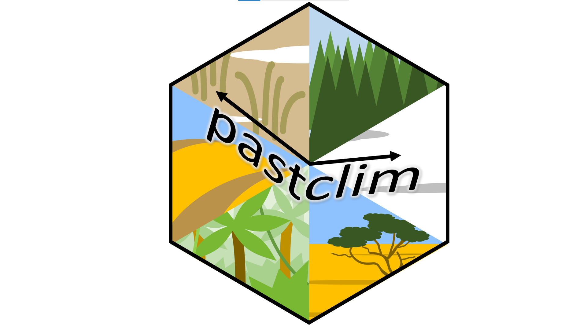

# pastclim 

<!-- badges: start -->
[](https://circleci.com/gh/EvolEcolGroup/pastclim/tree/master)
[](https://codecov.io/gh/EvolEcolGroup/pastclim)
<!-- badges: end -->

This library is designed to provide an easy way to extract and manipulate paleoclimate
reconstructions for ecological and anthropological analyses. It currently focuses
on data from Beyer et al 2020, a reconstruction of climate based on the HadCM3 
model for the last 120k years, and Krapp et al 2021, which covers the last 800k years.
The reconstructions are bias-corrected and downscaled to 0.5 degree.

## Install the library

You will need to install the library from Github. For this step, you will need to
use `devtools` (if you haven't done so already, install it from CRAN with `install.packages("devtools")`.
Once you have `devtools`, simply use:
```
devtools::install_github("EvolEcolGroup/pastclim")
```

There is a vignette with detailed step by step examples on how to use the library. You can
find it on the website for the package. Or, if when can build it when installing
`pastclim` :
```
devtools::install_github("EvolEcolGroup/pastclim", build_vignette = TRUE)
```
And read it directly in R with:
```
vignette("pastclim_overview",package="pastclim")
```
The vignette also provides instructions on how to install the optional
companion package `pastclimData`, which simplifies the task of downloading and 
storing the climate simulations.

---

NOTE: `pastclim` relies on `terra` to process rasters. There is a known bug in
`terra` that leads to the occasional message: 
```
"Error in x$.self$finalize() : attempt to apply non-function"
```
This is an error related to garbage collection, which does not 
affect the script being correctly executed, so it can be ignored. More discussion
of this issue can be found on [stack**overflow**](https://stackoverflow.com/questions/61598340/why-does-rastertopoints-generate-an-error-on-first-call-but-not-second)
