# pastclim overview

## Install the library

`pastclim` is on CRAN, and the easiest way to install it is with:

``` r
install.packages("pastclim")
```

If you want the latest development version, you can get it from GitHub.
To install from GitHub, you will need to use `devtools`; if you haven’t
done so already, install it from CRAN with
`install.packages("devtools")`. Also, note that the `dev` version of
`pastclim` tracks changes in the `dev` version of `terra`, so you will
need to upgrade to both:

``` r
install.packages("terra", repos = "https://rspatial.r-universe.dev")
devtools::install_github("EvolEcolGroup/pastclim", ref = "dev")
```

On its dedicated [website](https://evolecolgroup.github.io/pastclim/),
you can find Articles giving you a step-by-step [overview of the
package](https://evolecolgroup.github.io/pastclim/articles/a0_pastclim_overview.html),
and a
[cheatsheet](https://evolecolgroup.github.io/pastclim/pastclim_cheatsheet.pdf).
There is also a [version](https://evolecolgroup.github.io/pastclim/dev/)
of the site updated for the `dev` version (on the top left, the version
number is in red, and will be in the format x.x.x.9xxx, indicating it is
a development version).

If you want to build the vignette directly in `R` when installing
`pastclim` from GitHub, you can :

``` r
devtools::install_github("EvolEcolGroup/pastclim",
  ref = "dev",
  build_vignettes = TRUE
)
```

And read it directly in R with:

``` r
vignette("pastclim_overview", package = "pastclim")
```

Depending on the operating system you use, you might need additional
packages to build a vignette.

## Download the data

You will need to download climatic reconstructions before being able to
do any real work with `pastclim`. Pastclim currently includes data from
Beyer et al 2020 (*Beyer2020*, a reconstruction of climate based on the
HadCM3 model for the last 120k years), Krapp et al 2021 (*Krapp2021*,
which covers the last 800k years with a statistical emulator of HadCM3),
Barreto et al 2023 (*Barreto2023*), covering the last 5M years using the
PALEO-PGEM emulator), the CHELSA-TraCE21k, covering the last 21k years
at high spatial and temporal resolution (*CHELSA_trace21k_0.5m_vsi*),
the HYDE3.3 database of land use reconstructions for the last 10k years
(*HYDE_3.3_baseline*) the *paleoclim* dataset, a selected few time steps
over the last 120k years at various resolutions (*paleoclim_RESm*), and
the WorldClim and CHELSA data (*WorldClim_2.1\_* and *CHELSA_2.1\_*,
present, and future projections with a number of models and emission
scenarios). More information on each of these datasets can be found
[here](https://evolecolgroup.github.io/pastclim/articles/a1_available_datasets.html),
or using the help page for a given dataset. For detailed instructions on
how to use the WorldClim and CHELSA datasets for present and future
reconstructions can be found in [this
article](https://evolecolgroup.github.io/pastclim/articles/a3_pastclim_present_and_future.html)
There are also instructions on how to build and use [custom
datasets](https://evolecolgroup.github.io/pastclim/articles/a2_custom_datasets.html),
but you will need some familiarity with handling `netcdf` files.

A list of all datasets available can be obtained by typing:

``` r
library(pastclim)
#> Loading required package: terra
#> terra 1.8.91
get_available_datasets()
#> Barreto2023, Beyer2020, CHELSA_trace21k_1.0_0.5m_vsi, Example, HYDE_3.3_baseline, Krapp2021, paleoclim_1.0_10m, paleoclim_1.0_2.5m, paleoclim_1.0_5m
#> for present day reconstructions, use "WorldClim_2.1_RESm" or "CHELSA_2.4_RESm" where RES is an available resolution.
#> for future predictions, use "WorldClim_2.1_GCM_SSP_RESm" or "CHELSA_2.1_GCM_SSP_RESm", where GCM is the GCM model, SSP is the Shared Socio-economic Pathways scenario.
#> use help("WorldClim_2.1") or help("CHELSA_2.1") for a list of available options
```

Please be aware that using any dataset made available to `pastclim` will
require to cite both `pastclim` as well as the original publication
presenting the dataset. The reference to cite for `pastclim` can be
obtained by typing

``` r
citation("pastclim")
#> To cite pastclim in publications use:
#> 
#>   Leonardi M, Hallet EY, Beyer R, Krapp M, Manica A (2023). "pastclim
#>   1.2: an R package to easily access and use paleoclimatic
#>   reconstructions." _Ecography_, *2023*, e06481. doi:10.1111/ecog.06481
#>   <https://doi.org/10.1111/ecog.06481>.
#> 
#> A BibTeX entry for LaTeX users is
#> 
#>   @Article{pastclim-article,
#>     title = {pastclim 1.2: an R package to easily access and use paleoclimatic reconstructions},
#>     author = {Michela Leonardi and Emily Y. Hallet and Robert Beyer and Mario Krapp and Andrea Manica},
#>     journal = {Ecography},
#>     year = {2023},
#>     volume = {2023},
#>     pages = {e06481},
#>     publisher = {Wiley},
#>     doi = {10.1111/ecog.06481},
#>   }
```

while the reference associated to any dataset of choice (in this case
“Beyer2020”) is displayed together with the general information on that
dataset through the command:

``` r
help("Beyer2020")
```

    #> Documentation for the Beyer2020 dataset
    #> 
    #> Description:
    #> 
    #>      This dataset covers the last 120k years, at intervals of 1/2 k
    #>      years, and a resolution of 0.5 degrees in latitude and longitude.
    #> 
    #> Details:
    #> 
    #>      IMPORTANT: If you use this dataset, make sure to cite the original
    #>      publication:
    #> 
    #>      Beyer, R.M., Krapp, M. & Manica, A. High-resolution terrestrial
    #>      climate, bioclimate and vegetation for the last 120,000 years. Sci
    #>      Data 7, 236 (2020). doi:10.1038/s41597-020-0552-1
    #>      <https://doi.org/10.1038/s41597-020-0552-1>
    #> 
    #>      The version included in 'pastclim' has the ice sheets masked, as
    #>      well as internal seas (Black and Caspian Sea) removed. The latter
    #>      are based on:
    #> 
    #>      <https://www.marineregions.org/gazetteer.php?p=details&id=4278>
    #> 
    #>      <https://www.marineregions.org/gazetteer.php?p=details&id=4282>
    #> 
    #>      As there is no reconstruction of their depth through time, modern
    #>      outlines were used for all time steps.
    #> 
    #>      Also, for bio15, the coefficient of variation was computed after
    #>      adding one to monthly estimates, and it was multiplied by 100
    #>      following <https://pubs.usgs.gov/ds/691/ds691.pdf>
    #> 
    #>      Changelog
    #> 
    #>      v1.1.0 Added monthly variables. Files can be downloaded from:
    #>      <https://zenodo.org/deposit/7062281>
    #> 
    #>      v1.0.0 Remove ice sheets and internal seas, and use correct
    #>      formula for bio15. Files can be downloaded from:
    #>      doi:10.6084/m9.figshare.19723405.v1
    #>      <https://doi.org/10.6084/m9.figshare.19723405.v1>

For the datasets available in `pastclim`, there are functions that help
you download the data and choose the variables. When you start
`pastclim` for the first time, you will need to set the path where
reconstructions are stored using `set_data_path`. By default, the
package data path will be used:

``` r
library(pastclim)
set_data_path()
```

    #> The data_path will be set to /home/andrea/.local/share/R/pastclim.
    #> A copy of the Example dataset will be copied there.
    #> This path will be saved by pastclim for future use.
    #> Proceed? 
    #> 
    #> 1: Yes
    #> 2: No

Press 1 if you are happy with the offered choices, and `pastclim` will
remember your data path in future sessions. Note that your data path
will look different than in this example, as it depends on your user
name and operating system.

If you prefer using a custom path (e.g. in “~/my_reconstructions”), it
can be set with:

``` r
set_data_path(path_to_nc = "~/my_reconstructions")
```

The package includes a small dataset, *Example*, that we will use in
this vignette but is not suitable for running real analyses; the real
datasets are large (from 100s of Mb to a few Gb), and you will need to
specify what you want to download (see below).

Let us start by inspecting the *Example* dataset. We can get a list of
variables available for this dataset with:

``` r
get_vars_for_dataset(dataset = "Example")
#> [1] "bio01" "bio10" "bio12" "biome"
```

and the available time steps can be obtained with:

``` r
get_time_bp_steps(dataset = "Example")
#> [1] -20000 -15000 -10000  -5000      0
```

We can also query the resolution of this dataset:

``` r
get_resolution(dataset = "Example")
#> [1] 1 1
```

so, the \*Example” dataset only has a resolution of 1x1 degree.

For *Beyer2020* and *Krapp2021*, you can get a list of available
variables for each dataset with:

``` r
get_vars_for_dataset(dataset = "Beyer2020")
#>  [1] "bio01"    "bio04"    "bio05"    "bio06"    "bio07"    "bio08"   
#>  [7] "bio09"    "bio10"    "bio11"    "bio12"    "bio13"    "bio14"   
#> [13] "bio15"    "bio16"    "bio17"    "bio18"    "bio19"    "npp"     
#> [19] "lai"      "biome"    "altitude" "rugosity"
```

and

``` r
get_vars_for_dataset(dataset = "Krapp2021")
#>  [1] "bio01"    "bio04"    "bio05"    "bio06"    "bio07"    "bio08"   
#>  [7] "bio09"    "bio10"    "bio11"    "bio12"    "bio13"    "bio14"   
#> [13] "bio15"    "bio16"    "bio17"    "bio18"    "bio19"    "npp"     
#> [19] "biome"    "lai"      "altitude" "rugosity"
```

Note that, by default, only annual variables are shown. To see the
available monthly variables, simply use:

``` r
get_vars_for_dataset(dataset = "Beyer2020", annual = FALSE, monthly = TRUE)
#>  [1] "temperature_01"       "temperature_02"       "temperature_03"      
#>  [4] "temperature_04"       "temperature_05"       "temperature_06"      
#>  [7] "temperature_07"       "temperature_08"       "temperature_09"      
#> [10] "temperature_10"       "temperature_11"       "temperature_12"      
#> [13] "precipitation_01"     "precipitation_02"     "precipitation_03"    
#> [16] "precipitation_04"     "precipitation_05"     "precipitation_06"    
#> [19] "precipitation_07"     "precipitation_08"     "precipitation_09"    
#> [22] "precipitation_10"     "precipitation_11"     "precipitation_12"    
#> [25] "cloudiness_01"        "cloudiness_02"        "cloudiness_03"       
#> [28] "cloudiness_04"        "cloudiness_05"        "cloudiness_06"       
#> [31] "cloudiness_07"        "cloudiness_08"        "cloudiness_09"       
#> [34] "cloudiness_10"        "cloudiness_11"        "cloudiness_12"       
#> [37] "relative_humidity_01" "relative_humidity_02" "relative_humidity_03"
#> [40] "relative_humidity_04" "relative_humidity_05" "relative_humidity_06"
#> [43] "relative_humidity_07" "relative_humidity_08" "relative_humidity_09"
#> [46] "relative_humidity_10" "relative_humidity_11" "relative_humidity_12"
#> [49] "wind_speed_01"        "wind_speed_02"        "wind_speed_03"       
#> [52] "wind_speed_04"        "wind_speed_05"        "wind_speed_06"       
#> [55] "wind_speed_07"        "wind_speed_08"        "wind_speed_09"       
#> [58] "wind_speed_10"        "wind_speed_11"        "wind_speed_12"       
#> [61] "mo_npp_01"            "mo_npp_02"            "mo_npp_03"           
#> [64] "mo_npp_04"            "mo_npp_05"            "mo_npp_06"           
#> [67] "mo_npp_07"            "mo_npp_08"            "mo_npp_09"           
#> [70] "mo_npp_10"            "mo_npp_11"            "mo_npp_12"
```

For monthly variables, months are coded as “\_xx” at the end of the
variable names; e.g. “temperature_02” is the mean monthly temperature
for February. A more thorough description of each variable (including
the units) can be obtained with:

``` r
get_vars_for_dataset(dataset = "Example", details = TRUE)
#>   variable                           long_name           units
#> 1    bio01             annual mean temperature degrees Celsius
#> 2    bio10 mean temperature of warmest quarter degrees Celsius
#> 3    bio12                annual precipitation     mm per year
#> 4    biome                 biome (from BIOME4)
```

You will not be able to get the available time steps until you download
the dataset. `pastclim` offers an interface to download the necessary
files into your data path.

To inspect which datasets and variables have already been downloaded in
the data path, we can use:

``` r
get_downloaded_datasets()
#> $Example
#> [1] "bio01" "bio10" "bio12" "biome"
```

Let’s now download *bio01* and *bio05* for the *Beyer2020* dataset (this
operation might take several minutes, as the datasets are large; `R`
will pause until the download is complete):

``` r
download_dataset(dataset = "Beyer2020", bio_variables = c("bio01", "bio05"))
```

Note that multiple variables can be packed together into a single file,
so
[`get_downloaded_datasets()`](https://evolecolgroup.github.io/pastclim/dev/reference/get_downloaded_datasets.md)
might list more variables than the ones that we chose to download (it
depends on the dataset).

When upgrading `pastclim`, new version of various datasets might become
available. This will make the previously downloaded datasets obsolete,
and you might suddenly be told by `pastclim` that some variables have to
be re-downloaded. This can lead to the accumulation of old datasets in
your data path. The function
[`clean_data_path()`](https://evolecolgroup.github.io/pastclim/dev/reference/clean_data_path.md)
can be used to delete old files that are no longer needed.

## Get climate for locations

Often we want to get the climate for specific locations. We can do so by
using the function `location_slice`. With this function, we will get
slices of climate for the times relevant to the locations of interest.

Let us consider five possible locations of interest: Iho Eleru (a Late
Stone Age inland site in Nigeria), La Riera (a Late Palaeolithic coastal
site on Spain), Chalki (a Mesolithic site on a Greek island), Oronsay (a
Mesolithic site in the Scottish Hebrides), and Atlantis (the fabled
submersed city mentioned by Plato). For each site we have a date
(realistic, but made up) that we are interested in associating with
climatic reconstructions.

``` r
locations <- data.frame(
  name = c("Iho Eleru", "La Riera", "Chalki", "Oronsay", "Atlantis"),
  longitude = c(5, -4, 27, -6, -24), latitude = c(7, 44, 36, 56, 31),
  time_bp = c(-11200, -18738, -10227, -10200, -11600)
)
locations
#>        name longitude latitude time_bp
#> 1 Iho Eleru         5        7  -11200
#> 2  La Riera        -4       44  -18738
#> 3    Chalki        27       36  -10227
#> 4   Oronsay        -6       56  -10200
#> 5  Atlantis       -24       31  -11600
```

And extract their climatic conditions for *bio01* and *bio12*:

``` r
location_slice(
  x = locations, bio_variables = c("bio01", "bio12"),
  dataset = "Example", nn_interpol = FALSE
)
#>        name longitude latitude time_bp time_bp_slice     bio01    bio12
#> 1 Iho Eleru         5        7  -11200        -10000 25.346703 2204.595
#> 2  La Riera        -4       44  -18738        -20000  5.741851 1149.570
#> 3    Chalki        27       36  -10227        -10000        NA       NA
#> 4   Oronsay        -6       56  -10200        -10000  6.937467 1362.824
#> 5  Atlantis       -24       31  -11600        -10000        NA       NA
```

`pastclim` finds the closest time step (slice) available for a given
date, and outputs the slice used in column `time_bp_slice` (the
*Example* dataset that we use in this vignette has a temporal resolution
of only 5k years).

Note that Chalki and Atlantis are not available (we get NA) for the
appropriate time steps. This occurs when a location, in the
reconstructions, was either under water or ice, and so `pastclim` can
not return any estimate. In some instances, this is due to the
discretisation of space in the raster. We can interpolate climate among
the nearest neighbours, thus using climate reconstructions for
neighbouring pixels if the location is just off one or more land pixels:

``` r
location_slice(
  x = locations, bio_variables = c("bio01", "bio12"),
  dataset = "Example", nn_interpol = TRUE
)
#>        name longitude latitude time_bp time_bp_slice     bio01     bio12
#> 1 Iho Eleru         5        7  -11200        -10000 25.346703 2204.5950
#> 2  La Riera        -4       44  -18738        -20000  5.741851 1149.5703
#> 3    Chalki        27       36  -10227        -10000 17.432425  723.1012
#> 4   Oronsay        -6       56  -10200        -10000  6.937467 1362.8245
#> 5  Atlantis       -24       31  -11600        -10000        NA        NA
```

For Chalki, we can see that the problem is indeed that, since it is a
small island, it is not well represented in the reconstructions (bear in
mind that the `Example` dataset is very coarse in spatial resolution),
and so we can reconstruct some appropriate climate by interpolating.
Atlantis, on the other hand, is the middle of the ocean, and so there is
no information on what the climate might have been before became
submerged (assuming it ever existed…). Note that `nn_interpol = TRUE` is
the default for this function.

Sometimes, we want to get a time series of climatic reconstructions,
thus allowing us to see how climate changed over time:

``` r
locations_ts <- location_series(
  x = locations,
  bio_variables = c("bio01", "bio12"),
  dataset = "Example"
)
```

The resulting dataframe can be subsetted to get the time series for each
location (the small *Example* dataset only contains 5 time slices):

``` r
subset(locations_ts, name == "Iho Eleru")
#>          name longitude latitude time_bp    bio01    bio12
#> 1   Iho Eleru         5        7  -20000 22.55133 1577.238
#> 1.1 Iho Eleru         5        7  -15000 23.27008 1850.715
#> 1.2 Iho Eleru         5        7  -10000 25.34670 2204.595
#> 1.3 Iho Eleru         5        7   -5000 25.65009 2109.735
#> 1.4 Iho Eleru         5        7       0 26.77033 1840.845
```

Also note that for some locations, climate can be available only for
certain time steps, depending on sea level and ice sheet extent. This is
the case for Oronsay:

``` r
subset(locations_ts, name == "Oronsay")
#>        name longitude latitude time_bp    bio01    bio12
#> 4   Oronsay        -6       56  -20000       NA       NA
#> 4.1 Oronsay        -6       56  -15000       NA       NA
#> 4.2 Oronsay        -6       56  -10000 6.937467 1362.824
#> 4.3 Oronsay        -6       56   -5000 8.167976 1462.253
#> 4.4 Oronsay        -6       56       0 8.185000 1434.490
```

We can quickly plot `bio01` through time for the locations:

``` r
library(ggplot2)
ggplot(data = locations_ts, aes(x = time_bp, y = bio01, group = name)) +
  geom_line(aes(col = name)) +
  geom_point(aes(col = name))
#> Warning: Removed 12 rows containing missing values or values outside the scale range
#> (`geom_line()`).
#> Warning: Removed 12 rows containing missing values or values outside the scale range
#> (`geom_point()`).
```

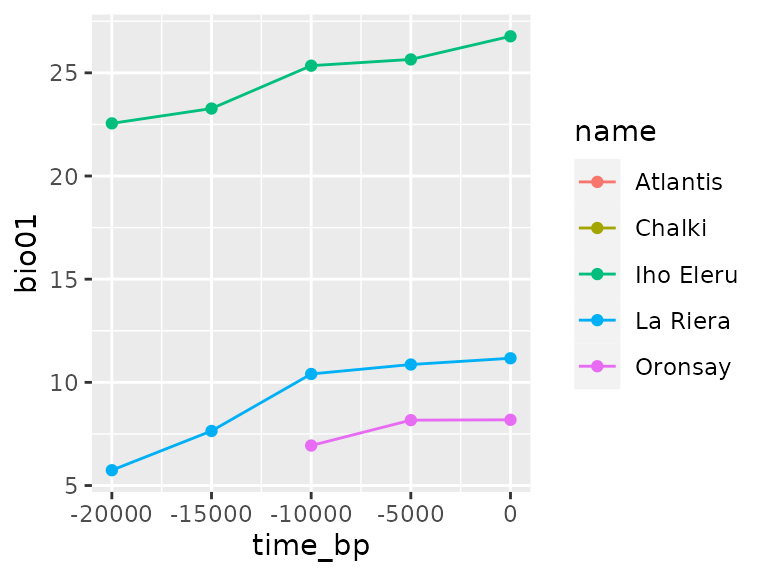

As expected, we don’t have data for Atlantis (as it is always
underwater), but we also fail to retrieve data for Chalki. This is
because `location_series` does not interpolate from nearest neighbours
by default (so, it differs from `location_slice` in behaviour). The
rationale for this behaviour is that we are interested in whether some
locations might end up underwater, and so we do not want to grab climate
estimates if they have been submerged. However, in some cases (as for
Chalki) it might be necessary to allow for interpolation.

Pretty labels for environmental variables can be generated with
`var_labels`:

``` r
library(ggplot2)
ggplot(data = locations_ts, aes(x = time_bp, y = bio01, group = name)) +
  geom_line(aes(col = name)) +
  geom_point(aes(col = name)) +
  labs(
    y = var_labels("bio01", dataset = "Example", abbreviated = TRUE),
    x = "time BP (yr)"
  )
#> Warning: Removed 12 rows containing missing values or values outside the scale range
#> (`geom_line()`).
#> Warning: Removed 12 rows containing missing values or values outside the scale range
#> (`geom_point()`).
```

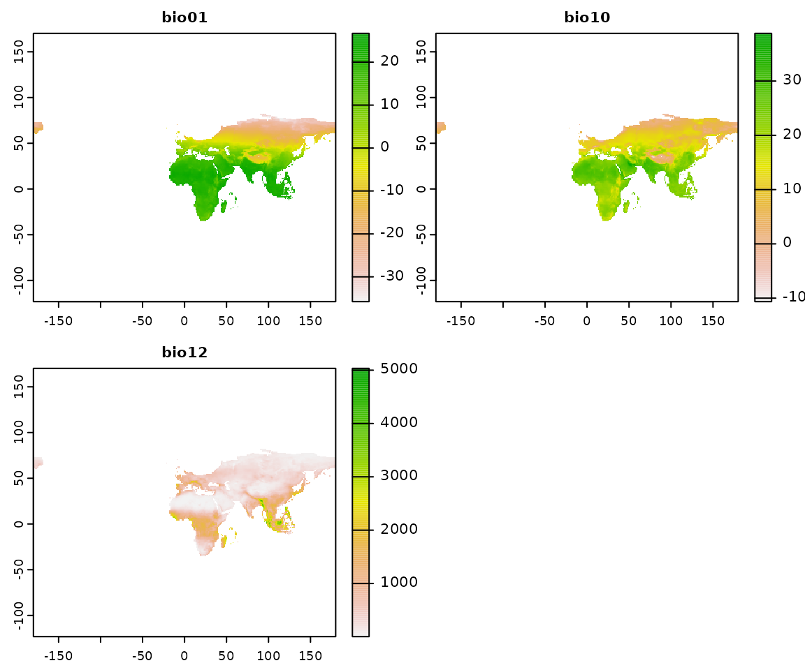

*Note* that these climatic reconstructions were extracted from the
`Example` dataset, which is very coarse, so they should not be used to
base any real inference about their environmental conditions. But note
also that higher resolution is not always better. It is important to
consider the appropriate spatial scale that is relevant to the question
at hand. Sometimes, it might be necessary to downscale the simulations
(see section at the end of this vignette), or in other cases we might
want to get estimates to cover an area around the specific location
(e.g. if we are comparing to proxies that capture the climatology of a
broad area, such as certain sediment cores that capture pollen from the
broader region). `location_slice` and `location_series` can provide mean
estimates for areas around the location coordinates by setting the
`buffer` parameter (see the help pages of those functions for details).

## Get climate for a region

Instead of focussing on specific locations, we might want to look at a
whole region. For a given time step, we can extract a slice of climate
with

``` r
climate_20k <- region_slice(
  time_bp = -20000,
  bio_variables = c("bio01", "bio10", "bio12"),
  dataset = "Example"
)
```

This returns a raster (technically a `SpatRaster` object as defined in
the `terra` library, meaning that we can perform all standard `terra`
raster operations on this object). To interact with `SpatRaster`
objects, you will need to have the library `terra` loaded (otherwise you
might get errors as the correct method is not found, e.g. when
plotting). `pastclim` automatically loads `terra`, so you should be able
to work with `terra` objects without any problem:

``` r
climate_20k
#> class       : SpatRaster 
#> size        : 150, 360, 3  (nrow, ncol, nlyr)
#> resolution  : 1, 1  (x, y)
#> extent      : -180, 180, -60, 90  (xmin, xmax, ymin, ymax)
#> coord. ref. : lon/lat WGS 84 (CRS84) (OGC:CRS84) 
#> sources     : example_climate_v1.3.0.nc:BIO1  
#>               example_climate_v1.3.0.nc:BIO10  
#>               example_climate_v1.3.0.nc:BIO12  
#> varnames    : bio01 (annual mean temperature) 
#>               bio10 (mean temperature of warmest quarter) 
#>               bio12 (annual precipitation) 
#> names       :           bio01,           bio10,       bio12 
#> unit        : degrees Celsius, degrees Celsius, mm per year 
#> time (years): -18050
```

and plot these three variables (the layers of the raster):

``` r
terra::plot(climate_20k)
```

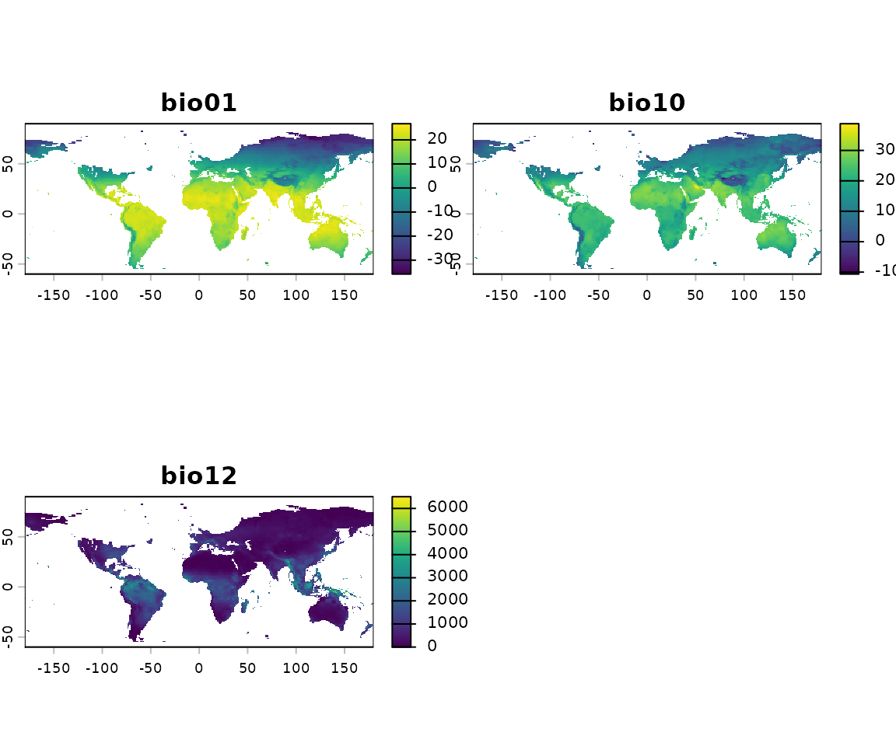

We can add more informative labels with `var_labels`:

``` r
terra::plot(climate_20k,
  main = var_labels(climate_20k, dataset = "Example", abbreviated = TRUE)
)
```


It is possible to also load a time series of rasters with the function
`region_series`. In this case, the function returns a
`SpatRasterDataset`, with each variable as a sub-dataset:

``` r
climate_region <- region_series(
  time_bp = list(min = -15000, max = 0),
  bio_variables = c("bio01", "bio10", "bio12"),
  dataset = "Example"
)
climate_region
#> class       : SpatRasterDataset 
#> subdatasets : 3 
#> dimensions  : 150, 360 (nrow, ncol)
#> nlyr        : 4, 4, 4 
#> resolution  : 1, 1  (x, y)
#> extent      : -180, 180, -60, 90  (xmin, xmax, ymin, ymax)
#> coord. ref. : lon/lat WGS 84 (CRS84) (OGC:CRS84) 
#> source(s)   : example_climate_v1.3.0.nc 
#> names       : bio01, bio10, bio12
```

Each of these sub-dataset is a `SpatRaster`, with time steps as layers:

``` r
climate_region$bio01
#> class       : SpatRaster 
#> size        : 150, 360, 4  (nrow, ncol, nlyr)
#> resolution  : 1, 1  (x, y)
#> extent      : -180, 180, -60, 90  (xmin, xmax, ymin, ymax)
#> coord. ref. : lon/lat WGS 84 (CRS84) (OGC:CRS84) 
#> source      : example_climate_v1.3.0.nc:BIO1 
#> varname     : bio01 (annual mean temperature) 
#> names       :    bio01_-15000,    bio01_-10000,     bio01_-5000,         bio01_0 
#> unit        : degrees Celsius 
#> time (years): -13050 to 1950 (4 steps)
```

Note that `terra` stores dates in years as AD, not BP. You can inspect
the times in years BP with:

``` r
time_bp(climate_region)
#> [1] -15000 -10000  -5000      0
```

We can then plot the time series of a given variable (we relabel the
plots to use years bp):

``` r
terra::plot(climate_region$bio01, main = time_bp(climate_region))
```

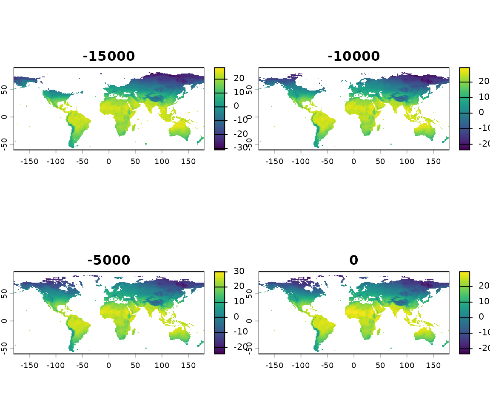

To plot all climate variables for a given time step, we can slice the
time series:

``` r
slice_10k <- slice_region_series(climate_region, time_bp = -10000)
terra::plot(slice_10k)
```

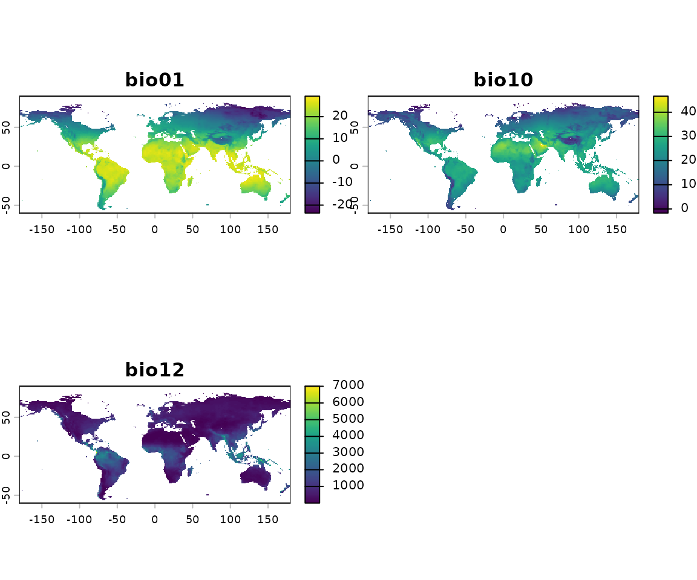

Instead of giving a minimum and maximum time step, you can also provide
specific time steps to `region_series`. Note that `pastclim` has a
function to get a vector of the time steps for a given MIS in a dataset.
For example, for MIS 1, we get:

``` r
mis1_steps <- get_mis_time_steps(mis = 1, dataset = "Example")
mis1_steps
#> [1] -10000  -5000      0
```

Which we can then use:

``` r
climate_mis1 <- region_series(
  time_bp = mis1_steps,
  bio_variables = c("bio01", "bio10", "bio12"),
  dataset = "Example"
)
climate_mis1
#> class       : SpatRasterDataset 
#> subdatasets : 3 
#> dimensions  : 150, 360 (nrow, ncol)
#> nlyr        : 3, 3, 3 
#> resolution  : 1, 1  (x, y)
#> extent      : -180, 180, -60, 90  (xmin, xmax, ymin, ymax)
#> coord. ref. : lon/lat WGS 84 (CRS84) (OGC:CRS84) 
#> source(s)   : example_climate_v1.3.0.nc 
#> names       : bio01, bio10, bio12
```

## Cropping

Often we want to focus a given region. There are a number of preset
rectangular extents in `pastclim`:

``` r
names(region_extent)
#> [1] "Africa"    "America"   "Asia"      "Europe"    "Eurasia"   "N_America"
#> [7] "Oceania"   "S_America"
```

We can get the corners of the European extent:

``` r
region_extent$Europe
#> [1] -15  70  33  75
```

And then we can extract climate only for Europe by setting `ext` in
`region_slice`:

``` r
europe_climate_20k <- region_slice(
  time_bp = -20000,
  bio_variables = c("bio01", "bio10", "bio12"),
  dataset = "Example",
  ext = region_extent$Europe
)
terra::plot(europe_climate_20k)
```

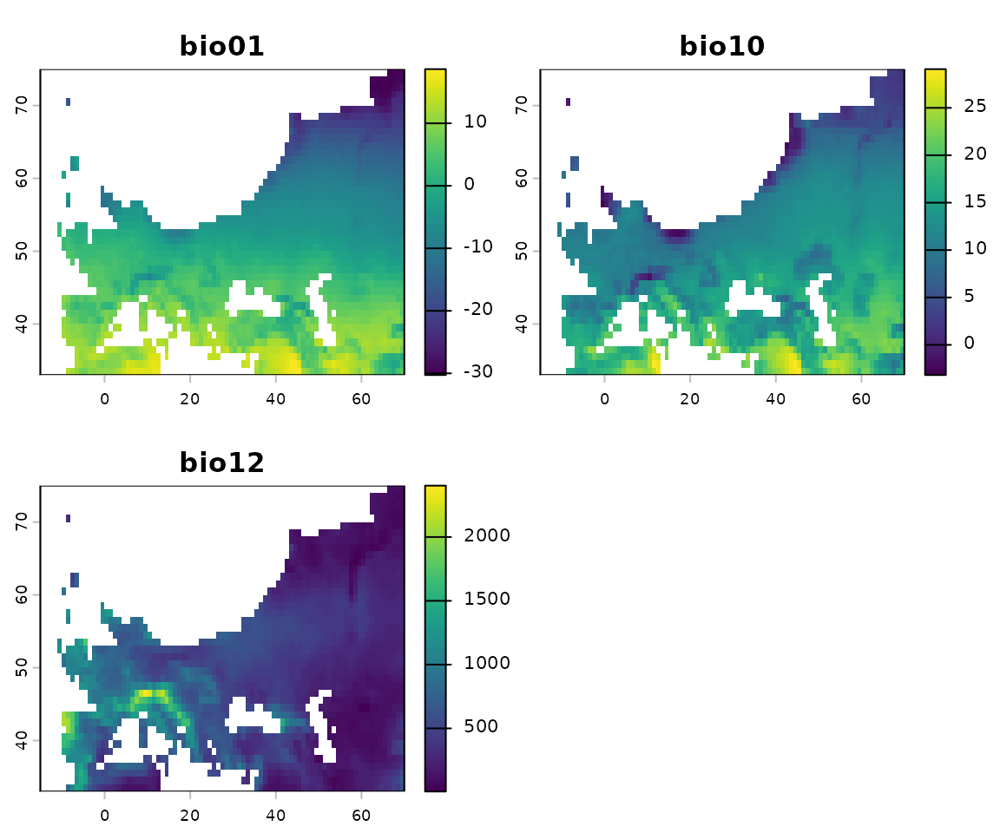

As we can see in the plot, cutting Europe using a rectangular shape
keeps a portion of Northern Africa in the map. `pastclim` includes a
number of pre-generated masks for the main continental masses, stored in
the dataset `region_outline` in an
[`sf::sfc`](https://r-spatial.github.io/sf/reference/sfc.html) object.
We can get a list with:

``` r
names(region_outline)
#> [1] "Africa"    "Eurasia"   "N_America" "Oceania"   "S_America" "Europe"
```

We can then use the function `crop` within `region_slice` to only keep
the area within the desired outline.

``` r
europe_climate_20k <- region_slice(
  time_bp = -20000,
  bio_variables = c("bio01", "bio10", "bio12"),
  dataset = "Example",
  crop = region_outline$Europe
)
terra::plot(europe_climate_20k)
```

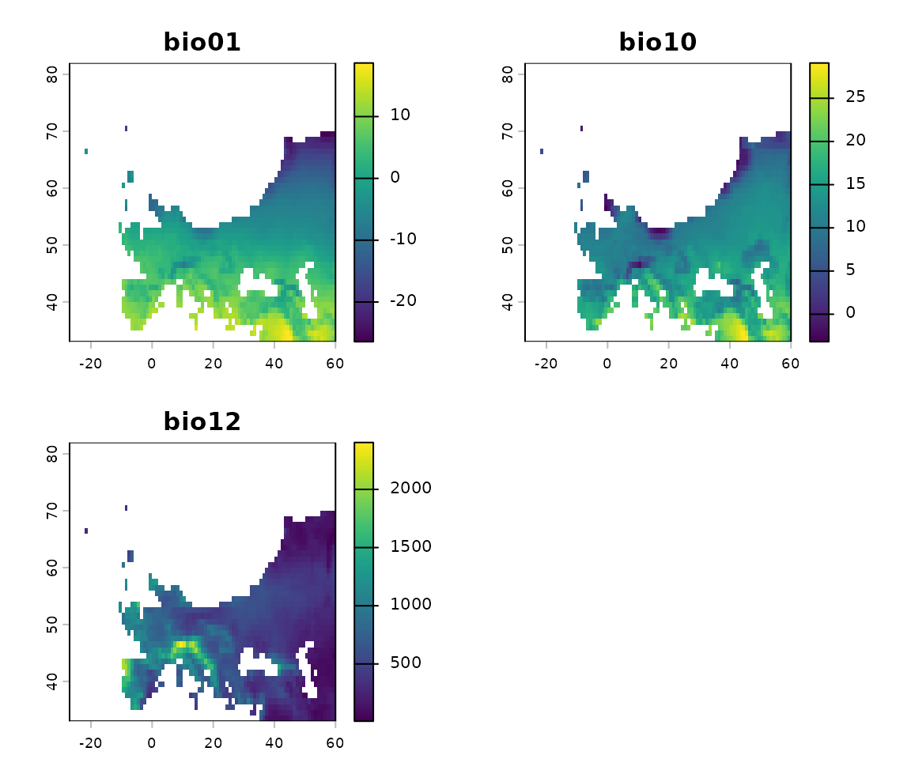

We can combine multiple regions together. For example, we can crop to
Africa and Eurasia by unioning the two individual outlines:

``` r
library(sf)
#> Linking to GEOS 3.12.1, GDAL 3.8.4, PROJ 9.4.0; sf_use_s2() is TRUE
afr_eurasia <- sf::st_union(region_outline$Africa, region_outline$Eurasia)
climate_20k_afr_eurasia <- region_slice(
  time_bp = -20000,
  bio_variables = c("bio01", "bio10", "bio12"),
  dataset = "Example",
  crop = afr_eurasia
)
terra::plot(climate_20k_afr_eurasia)
```

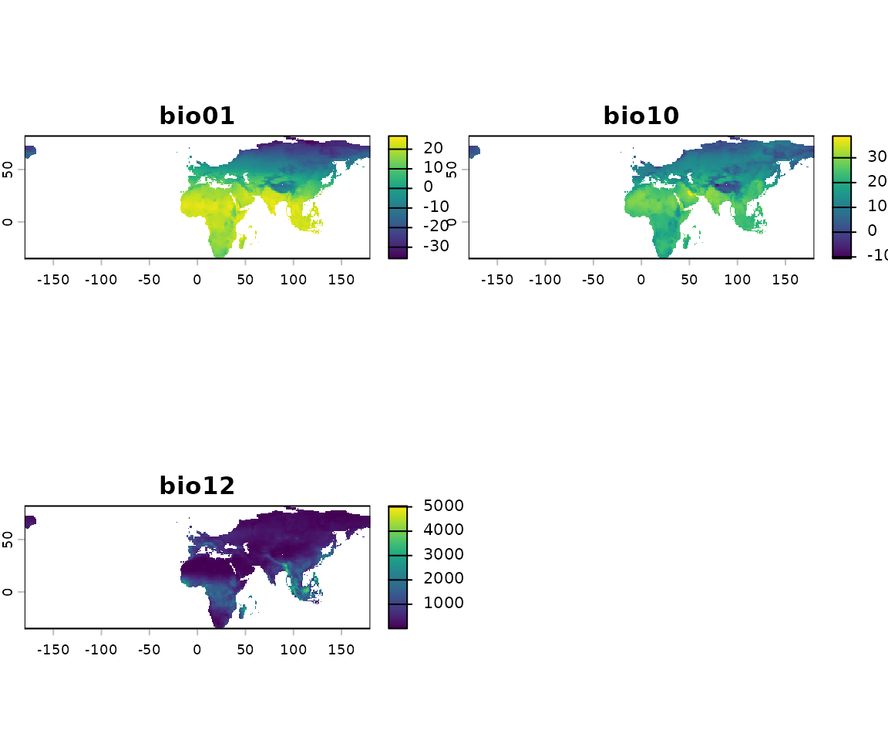

Note that outlines that cross the antimeridian are split into multiple
polygons (so that they can be used without projecting the rasters). For
Eurasia, we have the eastern end of Siberia on the left hand side of the
plot. `continent_outlines_union` provides the same outlines as single
polygons (in case you want to use a projection).

You can also use your own custom outline (i.e. a polygon, coded as a
[`terra::vect`](https://rspatial.github.io/terra/reference/vect.html)
object) as a mask to limit the area covered by the raster. Note that you
need to reuse the first vertex as the last vertex, to close the polygon:

``` r
custom_vec <- terra::vect("POLYGON ((0 70, 25 70, 50 80, 170 80, 170 10,
                              119 2.4, 119 0.8, 116 -7.6, 114 -12, 100 -40,
                              -25 -40, -25 64, 0 70))")
climate_20k_custom <- region_slice(
  time_bp = -20000,
  bio_variables = c("bio01", "bio10", "bio12"),
  dataset = "Example",
  crop = custom_vec
)
terra::plot(climate_20k_custom)
```

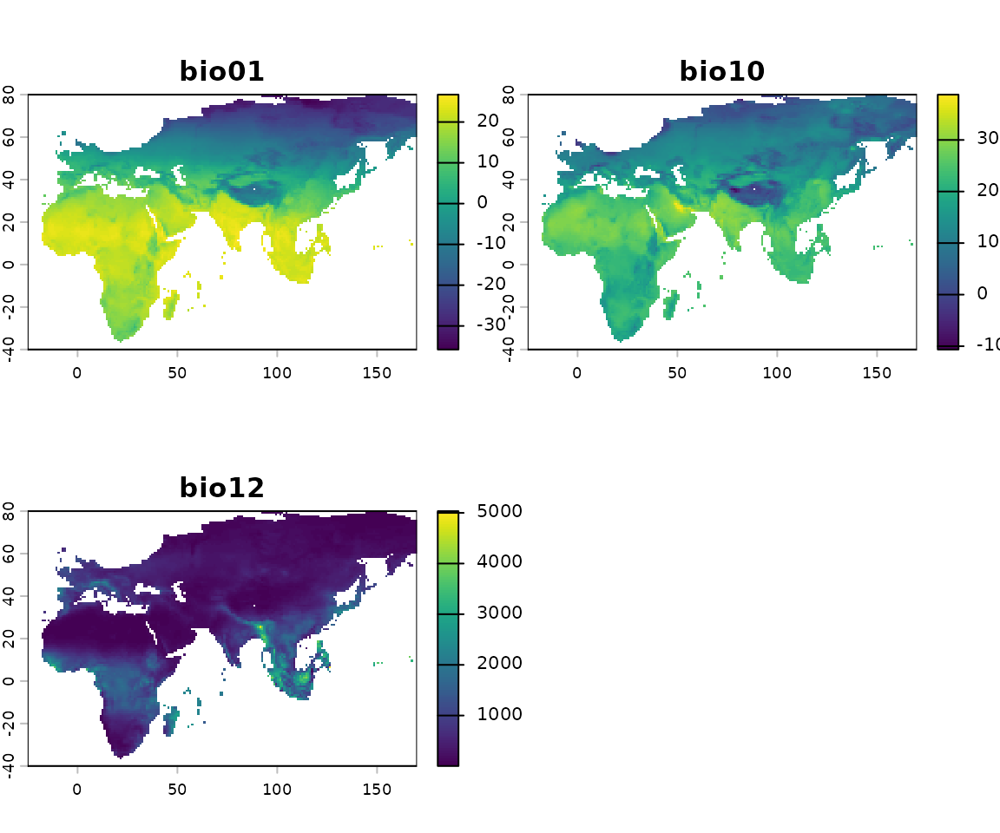

`region_series` takes the same `ext` and `crop` options as
`region_slice` to limit the extent of the climatic reconstructions.

## Working with biomes and ice sheets

The Beyer2020 and Krapp2021 datasets include a categorical variable
detailing the extension of biomes.

``` r
get_biome_classes("Example")
#>    id                           category
#> 1   0                       Water bodies
#> 2   1          Tropical evergreen forest
#> 3   2     Tropical semi-deciduous forest
#> 4   3 Tropical deciduous forest/woodland
#> 5   4         Temperate deciduous forest
#> 6   5           Temperate conifer forest
#> 7   6                  Warm mixed forest
#> 8   7                  Cool mixed forest
#> 9   8                Cool conifer forest
#> 10  9                  Cold mixed forest
#> 11 10      Evegreen taiga/montane forest
#> 12 11     Deciduous taiga/montane forest
#> 13 12                   Tropical savanna
#> 14 13      Tropical xerophytic shrubland
#> 15 14     Temperate xerophytic shrubland
#> 16 15     Temperate sclerophyll woodland
#> 17 16      Temperate broadleaved savanna
#> 18 17              Open conifer woodland
#> 19 18                    Boreal parkland
#> 20 19                 Tropical grassland
#> 21 20                Temperate grassland
#> 22 21                             Desert
#> 23 22                      Steppe tundra
#> 24 23                       Shrub tundra
#> 25 24                 Dwarf shrub tundra
#> 26 25             Prostrate shrub tundra
#> 27 26    Cushion forb lichen moss tundra
#> 28 27                             Barren
#> 29 28                           Land ice
```

We can get the biome for 20k years ago and plot it with:

``` r
biome_20k <- region_slice(
  time_bp = -20000,
  bio_variables = c("biome"),
  dataset = "Example"
)
plot(biome_20k)
```

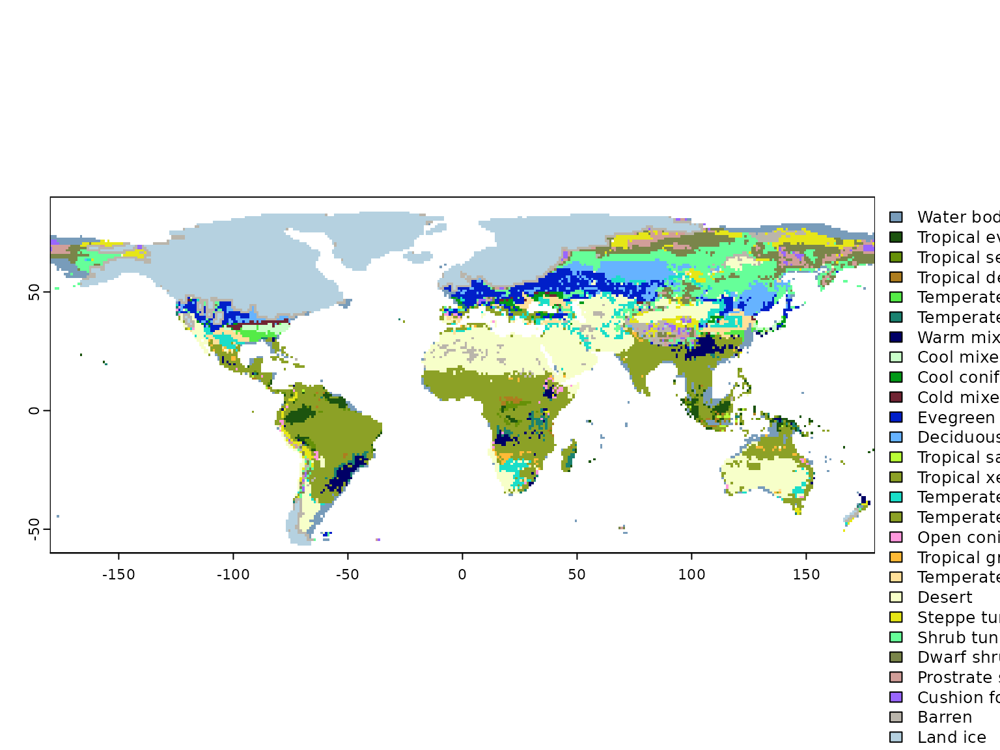

Note that the legend is massive. When plotting multiple time slices, it
is best to use `legned=FALSE` in the plotting statement to avoid having
the legend. If we need to plot the extent of a specific biome, for
example the desert, we can simply set the other levels to NA:

``` r
biome_20k$desert <- biome_20k$biome
biome_20k$desert[biome_20k$desert != 21] <- NA
terra::plot(biome_20k$desert)
```

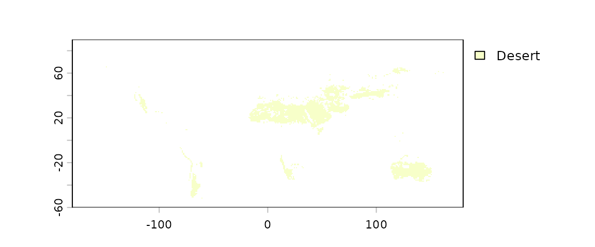

The climate reconstructions do not show areas under permanent ice. Ice
sheets are stored as class 28 in the “biome” variable. We can retrieve
directly the ice and land (all other biome categories) masks with:

``` r
ice_mask <- get_ice_mask(-20000, dataset = "Example")
land_mask <- get_land_mask(-20000, dataset = "Example")
terra::plot(c(ice_mask, land_mask))
```

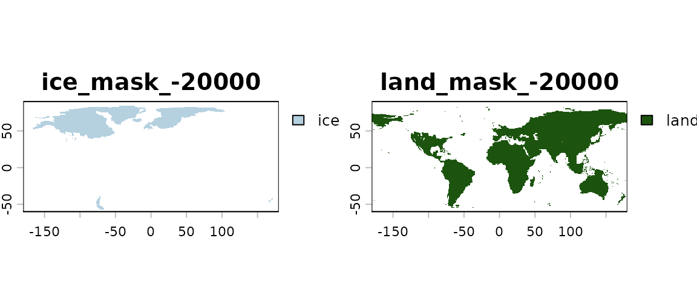

We can also add the ice sheets to plots of climatic variables. First, we
need to turn the ice mask into polygons:

``` r
ice_mask_vect <- as.polygons(ice_mask)
```

We can then add the polygons to each layer (i.e. variable) of climate
slice with the following code (note that, to add the polygons to every
panel of the figure, we need to create a function that is used as an
argument for `fun` within `plot`):

``` r
plot(climate_20k,
  fun = function() polys(ice_mask_vect, col = "gray", lwd = 0.5)
)
```

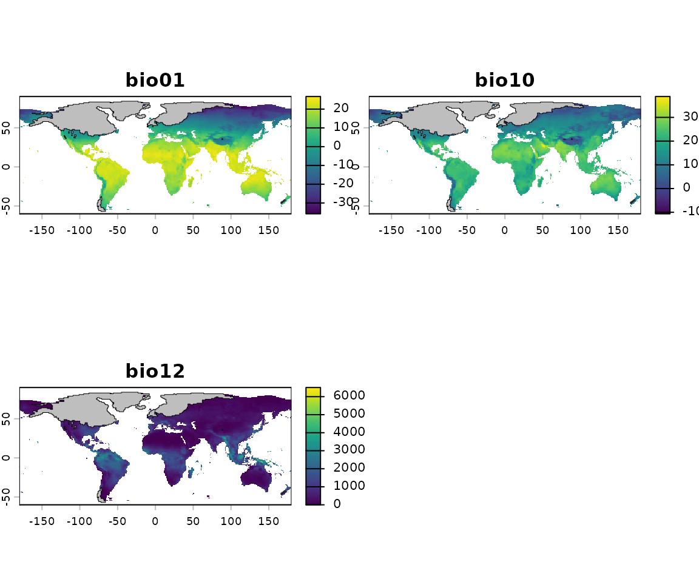

In some other cases, we have multiple time points of the same variable
and we want to see how the ice sheets change:

``` r
europe_climate <- region_series(
  time_bp = c(-20000, -15000, -10000, 0),
  bio_variables = c("bio01"),
  dataset = "Example",
  ext = region_extent$Europe
)
ice_masks <- get_ice_mask(c(-20000, -15000, -10000, 0),
  dataset = "Example"
)
ice_poly_list <- lapply(ice_masks, as.polygons)
plot(europe_climate$bio01,
  main = time_bp(europe_climate),
  fun = function(i) {
    polys(ice_poly_list[[i]],
      col = "gray",
      lwd = 0.5
    )
  }
)
```

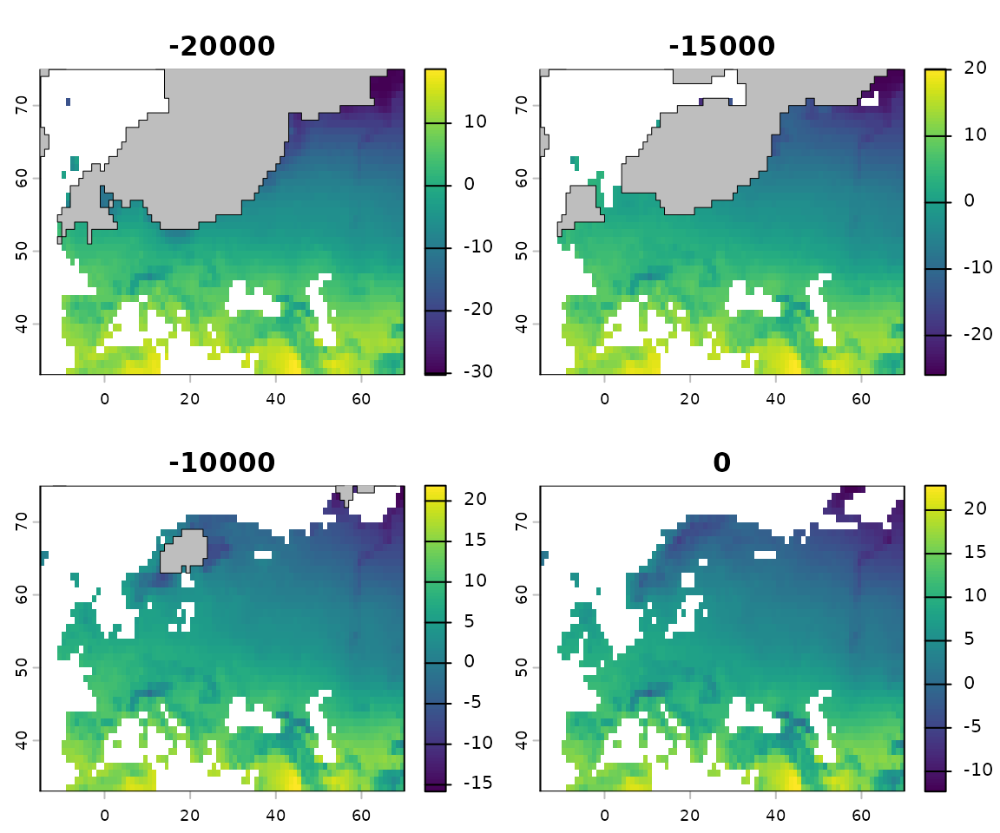

Note that to add the ice sheets in this instance, we build a function
that takes a single parameter *i* which is the index of the image (i.e.
*i* from 1 to 4 in the plot above) and use it to subset the list of ice
outlines.

Sometimes it is interesting to measure the distance from the coastline
(e.g. when modelling species that rely on brackish water, or to
determine the distance from marine resources in archaeology). In
`pastclim`, we can use use `distance_from_sea`, which accounts for sea
level change based on the landmask:

``` r
distances_sea <- distance_from_sea(time_bp = c(-20000, 0), dataset = "Example")
distances_sea_australia <- crop(distances_sea, terra::ext(100, 170, -60, 20))
plot(distances_sea_australia, main = time_bp(distances_sea_australia))
```

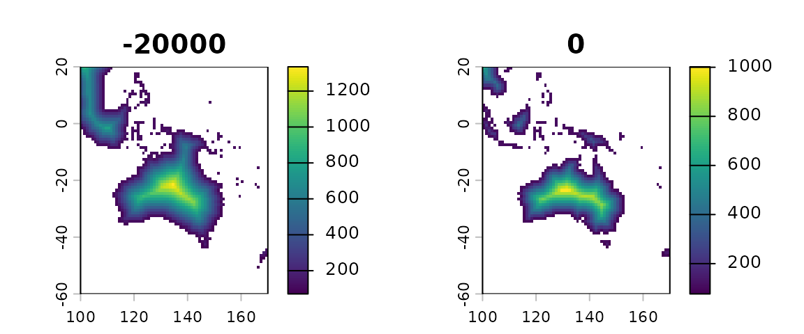

## Adding locations to region plots

To plot locations on region plots, we first need to create a
`SpatVector` object from the dataframe of metadata, specifying the names
of the columns with the x and y coordinates:

``` r
locations_vect <- vect(locations, geom = c("longitude", "latitude"))
locations_vect
#>  class       : SpatVector 
#>  geometry    : points 
#>  dimensions  : 5, 2  (geometries, attributes)
#>  extent      : -24, 27, 7, 56  (xmin, xmax, ymin, ymax)
#>  coord. ref. : +proj=longlat +datum=WGS84 +no_defs 
#>  names       :      name    time_bp
#>  type        :     <chr>      <num>
#>  values      : Iho Eleru  -1.12e+04
#>                 La Riera -1.874e+04
#>                   Chalki -1.023e+04
```

We can then add it to a climate slice with the following code (note
that, to add the points to every panel of the figure, we need to create
a function that is used as an argument for `fun` within `plot`):

``` r
plot(europe_climate_20k,
  fun = function() points(locations_vect, col = "red", cex = 2)
)
```

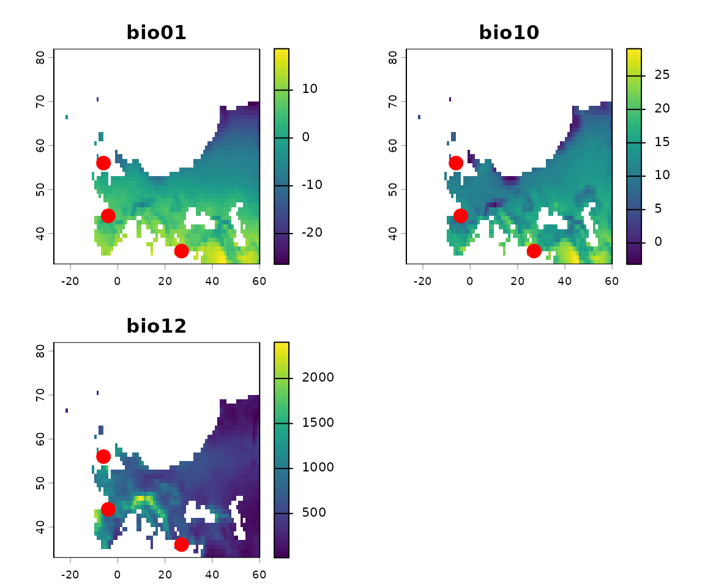

Only the points within the extent of the region will be plotted (so, in
this case, only the European locations).

We can combine ice sheets and locations in a single plot:

``` r
plot(europe_climate_20k,
  fun = function() {
    polys(ice_mask_vect, col = "gray", lwd = 0.5)
    points(locations_vect, col = "red", cex = 2)
  }
)
```

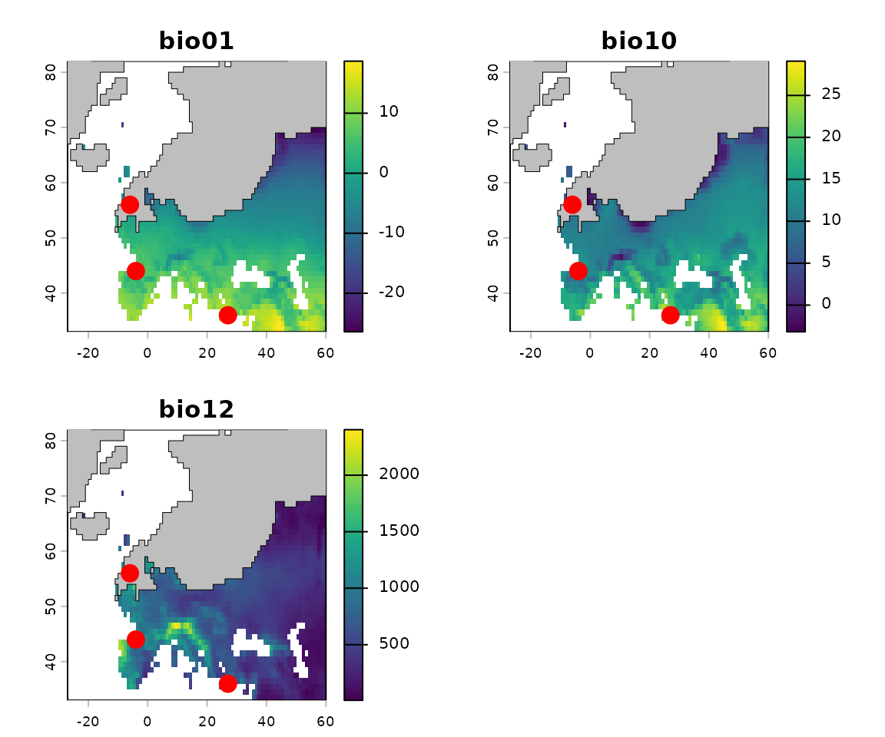

## Set the samples within the background

In many studies, we want to set the environmental conditions at a given
set of location within the background for that time period. Let us start
by visualising the background for the time step of interest with a PCA:

``` r
bio_vars <- c("bio01", "bio10", "bio12")
climate_10k <- region_slice(-10000,
  bio_variables = bio_vars,
  dataset = "Example"
)
climate_values_10k <- df_from_region_slice(climate_10k)
climate_10k_pca <- prcomp(climate_values_10k[, bio_vars],
  scale = TRUE, center = TRUE
)
plot(climate_10k_pca$x[, 2] ~ climate_10k_pca$x[, 1],
  pch = 20, col = "lightgray",
  xlab = "PC1", ylab = "PC2"
)
```

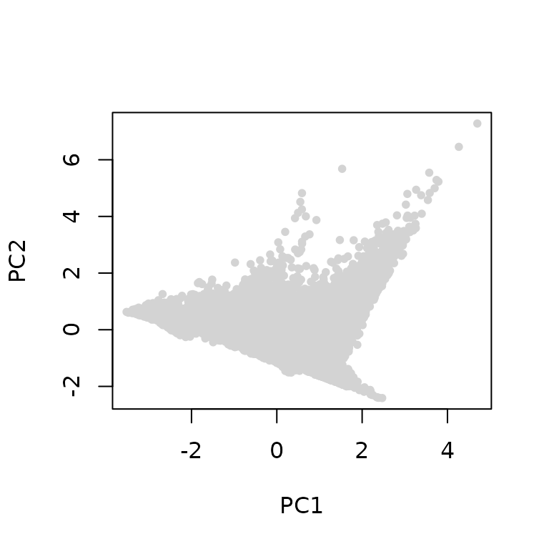

We can now get the climatic conditions for the locations at this time
step and compute the PCA scores based on the axes we defined on the
background:

``` r
locations_10k <- data.frame(
  longitude = c(0, 90, 20, 5), latitude = c(20, 45, 50, 47),
  time_bp = c(-9932, -9753, -10084, -10249)
)
climate_loc_10k <- location_slice(
  x = locations_10k[, c("longitude", "latitude")],
  time_bp = locations_10k$time_bp, bio_variables = bio_vars,
  dataset = "Example"
)
locations_10k_pca_scores <- predict(climate_10k_pca,
  newdata = climate_loc_10k[, bio_vars]
)
```

And now we can plot the points on top of the background

``` r
plot(climate_10k_pca$x[, 2] ~ climate_10k_pca$x[, 1],
  pch = 20, col = "lightgray",
  xlab = "PC1", ylab = "PC2"
)
points(locations_10k_pca_scores, pch = 20, col = "red")
```

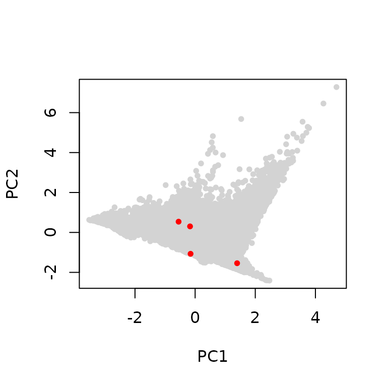

If we want to pool the background from multiple time steps, we can
simple use `region_series` to get a series, and then transform it into a
data frame with `df_from_region_series`.

## Random sampling of background

In some instances (e.g. when the underlying raster is too large to
handle), it might be desirable to sample the background instead of using
all values. If we are interested in a single time step, we can simply
generate the raster for the time slice of interest, and use
`sample_region_slice`:

``` r
climate_20k <- region_slice(
  time_bp = -20000,
  bio_variables = c("bio01", "bio10"),
  dataset = "Example"
)
this_sample <- sample_region_slice(climate_20k, size = 100)
head(this_sample)
#>    cell     x     y     bio01    bio10
#> 1 30435  14.5   5.5  19.20609 21.04144
#> 2 11098 117.5  59.5 -17.02355 10.63760
#> 3 46402 141.5 -38.5  11.20755 14.61647
#> 4 28719  98.5  10.5  23.08009 25.09301
#> 5 32526 -54.5  -0.5  21.08426 22.37266
#> 6 21694 -86.5  29.5  11.34134 22.99179
```

If we have samples from multiple time steps, we need to sample the
background proportionally to the number of points in each time step. So,
for example, if we wanted 30 samples from 20k years ago and 50 samples
from 10k years ago:

``` r
climate_ts <- region_series(
  time_bp = c(-20000, -10000),
  bio_variables = c("bio01", "bio10", "bio12"),
  dataset = "Example",
  ext = terra::ext(region_extent$Europe)
)
sampled_climate <- sample_region_series(climate_ts, size = c(3, 5))
sampled_climate
#>          cell    x    y     bio01    bio10    bio12 time_bp
#> -20000.1 2975 69.5 40.5  7.911747 19.28238 297.1093  -20000
#> -20000.2 2501 20.5 45.5  6.244859 15.19815 573.4572  -20000
#> -20000.3 1755 39.5 54.5 -5.482119 11.96673 528.3978  -20000
#> -10000.1 2285 59.5 48.5  3.014839 25.31847 158.6382  -10000
#> -10000.2 2842 21.5 41.5  9.267602 20.80721 666.6100  -10000
#> -10000.3 1407 31.5 58.5  2.976714 15.65665 533.5095  -10000
#> -10000.4 2155 14.5 49.5  6.449201 16.99319 594.5905  -10000
#> -10000.5 3251  5.5 36.5 12.860595 23.52949 663.8296  -10000
```

We could then use these data to build a PCA.

## Downscaling

`pastclim` does not contain built-in code to change the spatial
resolution of the climatic reconstructions, but it is possible to
downscale the data by using the relevant function from the `terra`
package.

At first we will need to extract a region and time of choice, in this
case Europe 10,000 years ago

``` r
europe_10k <- region_slice(
  dataset = "Example",
  bio_variables = c("bio01"),
  time_bp = -10000, ext = region_extent$Europe
)
terra::plot(europe_10k)
```


We can then downscale using the
[`disagg()`](https://rspatial.github.io/terra/reference/disaggregate.html)
function from the `terra` package, requiring an aggregation factor
expressed as number of cells in each direction (horizontally,
vertically, and, if needed, over layers). In the example below we used
25 both horizontally and vertically, using bilinear interpolation.

``` r
europe_ds <- terra::disagg(europe_10k, fact = 25, method = "bilinear")
terra::plot(europe_ds)
```

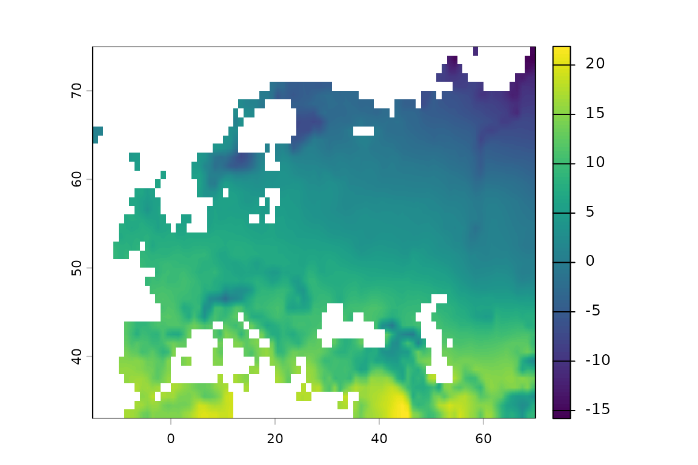

Note that, whilst we have smoothed the climate, the land mask has not
changed, and thus it still has very blocky edges.
